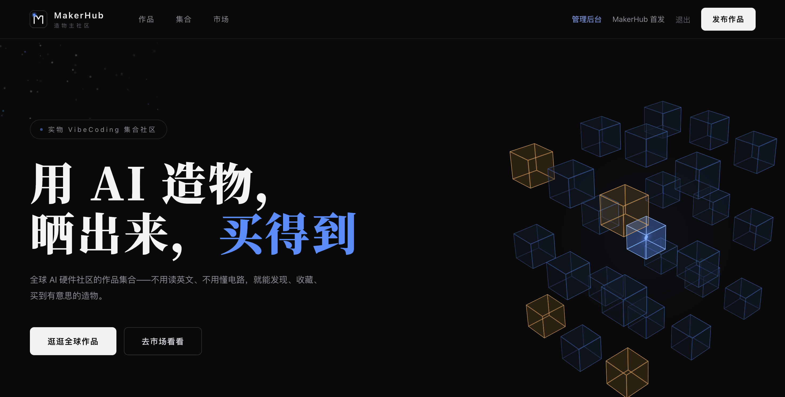

# 🔧 MakerHub · 造物主社区

**全球 AI 硬件作品的中文聚合社区 + 交易市场。**

Blueprint / Cirkit / Schematik 这类 AI 工具生成的硬件作品，散落在各个英文社区——看不懂英文、打不开外网、不知道怎么买。MakerHub 把这些作品**自动聚合、AI 翻译成中文**，让人逛、收藏、买到手。

> 🌐 线上：https://makerhub-eight.vercel.app

## 📸 预览

| 首页 | 作品集合 |
|---|---|
|  |  |

## ✨ 核心功能

- **作品集合**（/explore）——自动聚合全球 AI 硬件作品（Blueprint 社区等），AI 翻译中文简介、类型/难度标注、每日更新（Vercel Cron）
- **收藏**（⭐）——看到喜欢的作品一键收藏，个人主页随时回看
- **市场**（/market）——造物主上架成品/设计/教程，图片上传 + 闲鱼链接，买家一键跳转闲鱼成交
- **作品社区**——发布作品、点赞、评论、找料链接（淘宝/1688/拼多多）
- **新用户引导**——首次访问三步引导浮层
- **管理后台**——站长数据统计（用户/作品/商品/意向单）

## 🛠️ 技术栈

| 层 | 选型 |
|---|---|
| 框架 | Next.js 16 (App Router) + TypeScript + Tailwind CSS 4 |
| 数据库 | Turso (libsql) —— 本地文件 SQLite ↔ 生产托管，同一套代码 |
| AI 翻译 | DeepSeek（聚合内容批量翻译中文） |
| 定时任务 | Vercel Cron（每日聚合） |
| 动画 | 纯 CSS 3D（造物立方塔 27 方块组装/爆炸/旋转）+ Canvas 粒子 |

## 🚀 本地开发

```bash
pnpm install
pnpm dev        # http://localhost:3000
```

零配置启动：数据库默认文件 SQLite（自动创建 `makerhub.db`）。

## ☁️ 部署

1. 推送到 GitHub → [vercel.com](https://vercel.com) 导入
2. 配置环境变量（见 [.env.example](.env.example)）：
   - `TURSO_DATABASE_URL` / `TURSO_AUTH_TOKEN`（[Turso](https://turso.tech) 免费创建）
   - `LLM_API_KEY`（[DeepSeek](https://platform.deepseek.com)，用于聚合翻译）
   - `ADMIN_NAMES`（管理员用户名，逗号分隔）
   - `CRON_SECRET`（Vercel Cron 调用同步 API 的密钥）
3. 手动触发一次聚合：`GET /api/cron/sync`（带 `Authorization: Bearer $CRON_SECRET`）

## 📁 结构

```
src/
├── app/
│   ├── api/           # 同步/收藏/商品/意向单/作品/管理
│   ├── explore/       # 作品集合（聚合内容）
│   ├── market/        # 市场交易
│   ├── u/[name]/      # 个人主页（收藏/作品/商品/意向单）
│   └── submit/        # 发布作品 / 上架商品
├── components/        # 立方塔动画 / 旅程动画 / 卡片 / 收藏按钮…
└── lib/
    ├── aggregators/   # 内容聚合器（blueprint / reddit / 翻译）
    ├── db.ts          # 数据层（libsql）
    └── parts.ts       # 找料引擎（三渠道搜索链接）
```

## 🤝 参与

- 逛作品、收藏、提 Issue
- 造物主：上架你的作品/教程
- 开发者：PR 改进代码

## 📄 License

MIT
